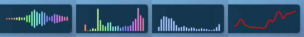

# Plasma Audio Visualizer

Audio visualizer widget powered by [CAVA](https://github.com/karlstav/cava) for the KDE Plasma Desktop



> [!NOTE]
> I have decided to stick with the current name for ease of search and discoverability of this niche of niches project. Thanks everyone for the feedback and name suggestions in the Kreddit!

## Installation

## Distribution packages

*Coming soon*

### KDE Store

*Coming Soon*

### Build from source (With C++ Plugin)

1. Install these dependencies or the equivalents for your distribution

    ```sh
    # Arch Linux
    sudo pacman -S git gcc cmake extra-cmake-modules libplasma cava
    # Fedora
    sudo dnf install git gcc-c++ cmake extra-cmake-modules libplasma-devel cava
    # Kubuntu
    sudo apt install git build-essential cmake extra-cmake-modules libplasma-dev cava
    ```

2. Clone and install

    ```sh
    git clone https://github.com/luisbocanegra/plasma-audio-visualizer.git
    cd plasma-audio-visualizer
    ./install.sh
    ```

#### Manual install for immutable distributions

1. Use the `-immutable` variants of the install script
2. Add `QML_IMPORT_PATH` environment variable for the C++ plugin to work:

    Create the file `~/.config/plasma-workspace/env/path.sh` (and folders if they don't exist) with the following:

    ```sh
    export QML_IMPORT_PATH="$HOME/.local/lib64/qml:$HOME/.local/lib/qml:$QML_IMPORT_PATH"
    ```

3. Log-out or reboot to apply the change*

## Support the development

If you like what I do consider donating/sponsoring this and [my other open source work](https://github.com/luisbocanegra?tab=repositories&q=&type=source)

[](https://github.com/sponsors/luisbocanegra) [](https://ko-fi.com/luisbocanegra) [](https://www.buymeacoffee.com/luisbocanegra) [](https://liberapay.com/luisbocanegra/) [](https://www.paypal.com/donate/?hosted_button_id=Y5TMH3Z4YZRDA)
